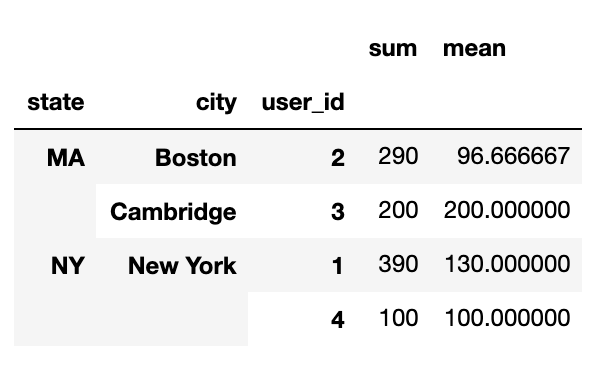

# Cleaning data - Quiz

We recommend you **do not** use Python to answer these questions. Instead, based on what you have learned in this section, _reason_ the code to choose an expected answer. 

??? 


# Pandas


?: Following is a preview of the DataFrame `df`:   

```python
    x      y  z
0   1.0  NaN  1
1   2.0  NaN  2
2   NaN  1.0  3
```

Match the commands with their expected outputs: 

1. `df.notna().sum()`  
2. `df.isna().any()`  
3. `df['z'].isna()`  

```python
# A
0    False
1    False
2    False
Name: z, dtype: bool

# B
x    2
y    1
z    3
dtype: int64

# C
x     True
y     True
z    False
dtype: bool
```

( ) 1-A|2-B|3-C 
( ) 1-C|2-B|3-A 
(X) 1-B|2-C|3-A 
( ) 1-A|2-C|3-B 

 


?: Following is a preview of the DataFrames `df_1` and `df_2`. Which of the following statement(s) are true? 


```python
df_1

          date  temperature humidity
0   2018/01/01           70       65
1   2018/01/02           68       70
2   2018/01/03           71       70

df_2

          date     variable value
0   2018/01/01  temperature    70
1   2018/01/02  temperature    68
2   2018/01/03  temperature    71
3   2018/01/01     humidity    65
4   2018/01/02     humidity    70
5   2018/01/03     humidity    70
```

[ ] `df_1` is in long format because each row represents an observation and each column represents a variable  
[X] `df_1` is in wide format because each row represents an observation and each column represents a variable  
[ ] `df_2` is in wide format because each observation is spread across multiple rows and there is only one variable in each row  
[X] `df_2` is in long format because each observation is spread across multiple rows and there is only one variable for a data point in time in each row   


?: Following is a preview of the DataFrames `customers` and `orders`. You want to add the `city` and `state` of all the customers who placed an order in `df_2`. Which type of join is appropriate for this task? 


`customers`

| user_id  | city  | state  |
|---|---|---|
|  1 | New York  | NY  |
|  2 | Boston  |  MA |
|  3 | Cambridge  | MA  |
|  4 | New York  | NY  |


`orders`

| order_id  | user_id  | order_amount  |
|---|---|---|
|1022   | 4  | 100  | 
|1023   | 1  | 120 |
|1024   | 3  | 200  | 
|1025   | 2  | 150  | 
|1026   | 2  | 50  |
|1027   | 1  | 200  | 


( ) Inner Join
(X) Right Join
( ) Outer Join


?: After correctly joining the above `customers` and `orders` tables, the output looks like this: 

`orders_merged` 

|user_id   | city  | state  | order_id  | order_amount  |
|---|---|---|---|---|
| 1  |New York   | NY  | 1023  | 120  |
| 1  |New York   | NY  | 1027  | 200  |
| 2  |Boston   | MA  | 1025  |  150 |
| 2  |Boston   | MA  | 1026  | 50  |
| 3  |Cambridge   | NY  | 1024  | 200  |
| 4  |New York   |  NY | 1022  | 100  |

How would you aggregate `orders_merged` to obtain the sum and average `order_amount` aggregated across `state`, `city`, and `user_id`? 


( ) `orders_merged.aggregate(['state', 'city', 'user_id'])['sum', 'mean']` 
( ) `orders_merged.agg(['order_amount'])['sum', 'mean'].groupby(['state', 'city', 'user_id'])` 
( ) `orders_merged.groupby(['state', 'city', 'user_id']).agg(['sum', 'mean'])` 
(X) `orders_merged.groupby(['state', 'city', 'user_id'])['order_amount'].agg(['sum', 'mean'])` 


?: If you chose the correct option above, your aggregated result will look like: 

`orders_aggregated`


<p align="center">

</p>

Which command would you use to reshape the above DataFrame as shown below: 

<p align="center">

</p>


( ) `orders_aggregated.stack(0)`  
( ) `orders_aggregated.stack(1)`  
(X) `orders_aggregated.unstack(0)`   
( ) `orders_aggregated.unstack()`


?: Again, which command would you use reshape the above `orders_aggregated` DataFrame to: 


<p align="center">

</p>


( ) `orders_aggregated.unstack(0)` 
( ) `orders_aggregated.stack(1)`    
( ) `orders_aggregated.unstack()`  
(X) `orders_aggregated.stack(0)`  


???
